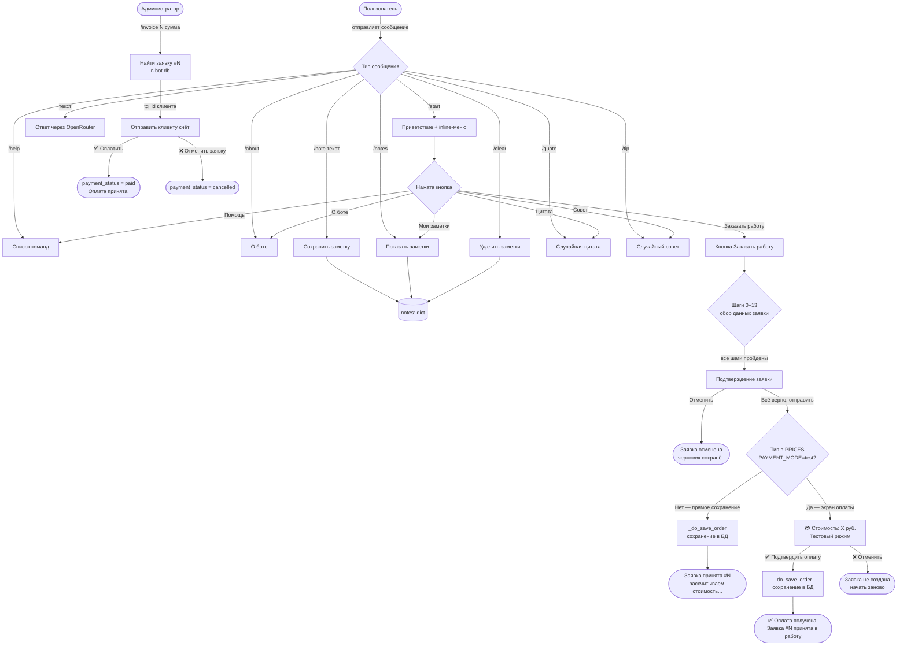

# Бот для учебных работ

## О проекте

Telegram-бот для приёма заказов на написание учебных работ — дипломы, диссертации, рефераты, контрольные и другие. Бот общается со студентами, собирает данные о заказе и отправляет готовый бриф владельцу сервиса в Telegram и на email.

**Тип:** Telegram-бот
**Технологии:** Python 3.11+, aiogram 3, SQLite, aiosqlite, aiosmtplib, openai (Whisper)
**Масштаб:** Серьёзный продукт для клиента

## Ключевые документы

- `промпт_бот_учебные_работы_v4.md` — системный промпт бота (логика диалога, сценарии, формат брифа)
- `ТЗ_бот_учебные_работы.md` — техническое задание на разработку

## Файлы базы данных

| Файл | База | Таблица | Назначение |
|------|------|---------|------------|
| `orders_db.py` | `fsm_storage.db` | `confirmed_orders` | Хранит только tg_id + tg_username — для проверки кнопки «Дополнить заказ». Не трогать. |
| `database.py` | `bot.db` | `orders` | Полное сохранение заявки (все 16 полей). Функция `save_full_order(data: dict) -> int` — вызывается в `cb_confirm_yes` после `save_order()`, возвращает id записи. |
| `database.py` | `bot.db` | `users` | Все пользователи бота. Создаётся через `upsert_user()` при каждом `/start`. |

Таблица `orders` в `bot.db`: id, tg_id, tg_username, name, work_type, institution, faculty, specialization, course, study_form, topic, volume, uniqueness, deadline, materials (строка через запятую), phone, email, created_at, **payment_status** (TEXT, DEFAULT 'pending').

Таблица `users` в `bot.db`: chat_id (PK), user_name, joined_at, is_active (1/0), consent (1/0).

## Система уведомлений и рассылок (слой 5)

Пятый архитектурный слой бота — управление пользователями, согласиями и рассылками. Реализован поверх слоёв FSM-сценария, базы данных и команд.

### Таблица users

Создаётся в `bot.db` функцией `_ensure()` из `database.py`. Поля:

| Поле | Тип | Описание |
|------|-----|----------|
| `chat_id` | INTEGER PK | Telegram ID пользователя |
| `user_name` | TEXT | Telegram username (без @), может быть NULL |
| `joined_at` | DATETIME | Дата первого `/start`, заполняется автоматически |
| `is_active` | INTEGER | 1 — активен, 0 — заблокировал бота |
| `consent` | INTEGER | 1 — согласен на рассылки, 0 — нет (по умолчанию) |

**Правило:** `consent` и `is_active` никогда не перезаписываются при повторном `/start` — только `user_name` обновляется (пользователь мог сменить ник).

### Функции database.py

| Функция | Что делает |
|---------|-----------|
| `upsert_user(chat_id, user_name)` | INSERT при первом визите, UPDATE user_name при повторном. Использует `ON CONFLICT DO UPDATE`. |
| `set_consent(chat_id, value)` | Устанавливает `consent = 0` или `1`. |
| `get_broadcast_recipients()` | Возвращает список `chat_id` всех пользователей с `consent=1`. |
| `set_inactive(chat_id)` | Устанавливает `is_active=0` когда Telegram вернул ошибку отправки. |
| `get_order_by_id(order_id)` | Возвращает заявку по ID как `dict` или `None`. Используется командой `/invoice`. |
| `update_order_payment_status(order_id, status)` | Обновляет `payment_status` заявки. Значения: `'pending'`, `'paid'`, `'cancelled'`. |

### Команды пользователя

- `/privacy` — показывает текст политики конфиденциальности (заглушка, требует замены `@ваш_контакт` на реальный).
- `/unsubscribe` — устанавливает `consent=0` и подтверждает отписку.

### Согласие при /start

После приветствия бот отправляет **отдельное сообщение** с информацией о сборе данных и двумя inline-кнопками:
- «Да, согласен ✅» → `consent=1`, кнопки убираются через `edit_reply_markup(None)`
- «Нет, спасибо» → `consent=0`, кнопки убираются

Кнопки убираются сразу после нажатия, чтобы исключить повторное нажатие.

### Команда /broadcast (только администратор)

```
/broadcast текст сообщения
```

- Доступна **только** пользователю с `ADMIN_ID` из `.env`. Все остальные — молча игнорируются (без ответа, чтобы не раскрывать существование команды).
- Берёт список получателей из `get_broadcast_recipients()` (только `consent=1`).
- При ошибке `TelegramForbiddenError` (пользователь заблокировал бота) вызывает `set_inactive(chat_id)`.
- После рассылки отправляет администратору отчёт: «Отправлено: N, заблокировали: M».

### Уведомление о новой заявке

Отправляется внутри `_do_save_order()` (файл `order_handlers.py`) — общей функции сохранения, которая вызывается из `cb_confirm_yes` (прямой путь) и `cb_pay_confirm` (после оплаты). Сообщение администратору:

```
🆕 Новая заявка #N
Тип: [тип работы]
Срок: [срок]
От: @username / Имя Фамилия
```

`ADMIN_ID` читается в `order_handlers.py` как `ADMIN_ID = int(os.getenv("ADMIN_ID", 0))` на уровне модуля. **Важно:** `load_dotenv()` в `bot.py` должен вызываться **до** импорта `order_handlers` — иначе переменная окружения не успеет загрузиться и `ADMIN_ID` будет равен 0. Уведомление завёрнуто в `try/except` — ошибка отправки не ломает подтверждение заявки.

## Система оплаты (слой 6)

Шестой архитектурный слой — имитация приёма оплаты для учебных целей. Реализован в `payment.py` и подключён к FSM-сценарию и командам администратора. Переключается через переменную `PAYMENT_MODE` в `.env`.

### Файл payment.py

Содержит всю конфигурацию и клавиатуры платёжной системы:

- `PAYMENT_MODE` — режим оплаты, читается из `.env`. `"test"` — тестовая имитация, `"live"` — заготовка для боевого эквайринга.
- `PRICES` — словарь стоимостей по типу работы:

| Тип работы | Стоимость |
|------------|-----------|
| Реферат | 1 500 руб. |
| Контрольная | 2 000 руб. |
| Курсовая | 3 500 руб. |
| Диплом бакалавра | 6 000 руб. |
| Диплом магистра | 9 000 руб. |

- `get_price(work_type)` — возвращает цену или `None` если тип не в прайсе (Доклад, Другое и т.д. — сохраняются без экрана оплаты).
- `format_price(amount)` — форматирует число в русском стиле: `6000` → `"6 000"`.
- `kb_payment()` — клавиатура для Варианта А: «✅ Подтвердить оплату» / «❌ Отменить».
- `kb_invoice(order_id, amount)` — клавиатура для Варианта Б: «✅ Оплатить» / «❌ Отменить заявку». Кнопки несут `order_id` и `amount` в `callback_data`.

### Вариант А — автоматический (FSM-сценарий)

Срабатывает при `PAYMENT_MODE=test` и если тип работы есть в `PRICES`.

Флоу после нажатия «✅ Всё верно, отправить» (`confirming` → `awaiting_payment`):

1. `cb_confirm_yes` показывает экран с суммой и кнопками (заявка в БД **ещё не сохранена**).
2. «✅ Подтвердить оплату» → `cb_pay_confirm` → вызывает `_do_save_order()` → сохраняет в обе БД, уведомляет администратора → финальное сообщение: «✅ Оплата получена! Заявка #N принята в работу.»
3. «❌ Отменить» → `cb_pay_cancel` → `state.clear()` → заявка не создаётся, предлагается начать заново.

Если тип работы **не в прайсе** — заявка сохраняется сразу, без экрана оплаты (прежнее поведение).

### Вариант Б — ручной (/invoice)

Команда для администратора, работает независимо от `PAYMENT_MODE`:

```
/invoice [номер_заявки] [сумма]
```

- Доступна **только** `ADMIN_ID`. Остальные — молча игнорируются.
- Находит заявку в `bot.db` по ID через `get_order_by_id()`.
- Отправляет клиенту (по `tg_id` из заявки) счёт с кнопками.
- «✅ Оплатить» → `cb_inv_pay` → `update_order_payment_status(order_id, "paid")` → сообщение клиенту: «✅ Оплата принята! Заказ #N подтверждён.»
- «❌ Отменить заявку» → `cb_inv_cancel` → `update_order_payment_status(order_id, "cancelled")` → сообщение клиенту.

### FSM-состояние awaiting_payment

Добавлено в `OrderStates` в `order_states.py`. Располагается между `confirming` и завершением сценария. Включён в `_BUTTON_ONLY` — текстовый ввод в этом состоянии игнорируется с подсказкой нажать кнопку.

### Поле payment_status в таблице orders

Добавляется через `ALTER TABLE ... ADD COLUMN` в `_ensure()` — безопасно для существующих баз данных (столбец уже существует → исключение перехватывается и игнорируется).

| Значение | Когда устанавливается |
|----------|-----------------------|
| `pending` | По умолчанию при создании заявки |
| `paid` | При подтверждении оплаты (Вариант А или Б) |
| `cancelled` | При отмене оплаты (Вариант Б) |

## Правила работы с Claude

### Язык и стиль общения
- Общаться на русском языке
- Объяснять термины простым языком, без жаргона
- Использовать аналогии из повседневной жизни там, где уместно

### Перед значительными изменениями
- Спрашивать перед большими или необратимыми изменениями
- Описать что планируется сделать и почему — получить подтверждение

### После значимых действий
- Предлагать сделать git-коммит после каждого завершённого шага
- Коротко описывать что было сделано

### Комментарии в коде
- Писать комментарии на русском языке
- Объяснять не ЧТО делает код, а ЗАЧЕМ и ПОЧЕМУ именно так

### Обработчики inline-кнопок (callback_query)
- При создании любых обработчиков inline-кнопок всегда ставить `await callback.answer()` или `await ack(call)` **первой строкой** внутри функции — до любой другой логики.
- Причина: Telegram ждёт подтверждения callback не более нескольких секунд. Если сначала выполняется другой код (например, запрос к БД или парсинг данных) и он зависает — кнопка «крутит» и не реагирует.

### Безопасность
- Никогда не прописывать токены, ключи и пароли прямо в код
- Все секреты — только в файл .env
- Файл .env должен быть в .gitignore

### Перезапуск бота
После любых изменений в файлах проекта (bot.py, system_prompt.md, handlers, database.py и др.) — автоматически перезапускай бота без дополнительного запроса.

## Проверка на баги
Когда я пишу «проверь на баги» — выполни следующее:
1. Найди состояния FSM из которых нельзя выйти (нет Назад, нет /cancel)
2. Проверь что все обработчики inline-кнопок имеют ack() первой строкой
3. Найди места где бот может упасть с ошибкой и не ответить пользователю
4. Проверь многоуровневые меню (переходы вперёд, назад, крайние случаи)
Не переписывай код — только исправь конкретные баги.

<!-- GSD:project-start source:PROJECT.md -->
## Project

**Бот-диспетчер учебных работ «Анна»**

Telegram-бот для автоматического приёма заказов на написание учебных работ. Бот выступает в роли вежливого администратора «Анны» — встречает студента, ведёт структурированный диалог, собирает все данные заказа и отправляет готовый бриф владельцу в Telegram и на email. Владелец получает структурированный заказ и уже без лишних переспросов связывается с клиентом лично.

**Core Value:** Каждый новый заказ автоматически приходит к специалисту в виде готового брифа — без ручного сбора данных, без потери деталей.
<!-- GSD:project-end -->

<!-- GSD:stack-start source:research/STACK.md -->
## Technology Stack

## Recommended Stack
### Core Framework
| Technology | Version | Purpose | Why |
|------------|---------|---------|-----|
| Python | 3.11+ | Runtime | 3.11 is the production sweet spot — faster than 3.10, more stable than 3.12/3.13 for ecosystem compatibility. aiogram 3.27 supports 3.10-3.14. |
| aiogram | 3.27.0 | Telegram Bot API framework | Latest stable (released 2026-04-03). Fully async, FSM built-in, router system for clean code structure, active development. The de-facto standard for Python Telegram bots. |
### Database
| Technology | Version | Purpose | Why |
|------------|---------|---------|-----|
| SQLite | built-in | Persistent order storage | Zero-infrastructure, file-based, adequate for hundreds of orders/day. No separate server process. |
| aiosqlite | 0.22.1 | Async SQLite adapter | Production/Stable (released 2025-12-23). Wraps sqlite3 with async/await so it doesn't block the event loop. Required with aiogram's async model. |
### Email
| Technology | Version | Purpose | Why |
|------------|---------|---------|-----|
| aiosmtplib | 5.1.0 | Async email sending | Latest stable (released 2026-01-25). Pure-async SMTP client, Python 3.10+ only. Works with both Gmail (port 465 TLS or 587 STARTTLS) and mail.ru (port 465 or 587). The synchronous smtplib would block the event loop — do not use it. |
### Voice Transcription
| Technology | Version | Purpose | Why |
|------------|---------|---------|-----|
| openai | 2.33.0 | Whisper API client + gpt-4o-transcribe | Latest stable (released 2026-04-28). The SDK wraps the REST API. Use `client.audio.transcriptions.create()`. |
| pydub | 0.25.1 | OGG-to-MP3/WAV conversion | Required bridge: Telegram delivers voice as OGG Opus, Whisper API does not accept OGG. pydub converts it in memory using FFmpeg. Requires FFmpeg installed on the host. |
### Configuration
| Technology | Version | Purpose | Why |
|------------|---------|---------|-----|
| python-dotenv | 1.2.2 | .env file loading | Latest stable (released 2026-03-01). Standard approach for 12-factor config. Loads BOT_TOKEN, OPENAI_API_KEY, SMTP credentials, OWNER_CHAT_ID from .env into os.environ. |
## Supporting Libraries
| Library | Version | Purpose | When to Use |
|---------|---------|---------|-------------|
| email (stdlib) | built-in | Construct MIME email messages | Always — use `email.message.EmailMessage` to build messages with attachments before passing to aiosmtplib |
| io (stdlib) | built-in | BytesIO for in-memory file handling | Voice download from Telegram without touching disk; pass BytesIO directly to OpenAI |
| logging (stdlib) | built-in | Structured logging | Always — configure at startup, critical for debugging production issues |
## Alternatives Considered
| Category | Recommended | Alternative | Why Not |
|----------|-------------|-------------|---------|
| Bot framework | aiogram 3 | python-telegram-bot 21.x | Both are excellent. aiogram 3 has a more modern async-native design with FSM built-in, better router pattern. python-telegram-bot requires separate conversation handler setup. Decision already made; validate: correct choice. |
| Database | SQLite + aiosqlite | PostgreSQL + asyncpg | PostgreSQL is overkill for a single-operator order bot with low volume. No network, no server, simpler deployment. Upgrade path is clear if volume grows. |
| FSM storage | MemoryStorage | RedisStorage | MemoryStorage loses state on bot restart — acceptable IF orders are persisted to SQLite immediately. For this bot the SQLite write is the source of truth; FSM is just conversation scaffolding. Use MemoryStorage for simplicity; document that restart drops mid-form sessions (rare, acceptable). |
| Voice transcription | openai Whisper API (whisper-1 or gpt-4o-transcribe) | Local Whisper model | Local model requires GPU or is slow on CPU, complex to deploy. API is pay-per-use (~$0.006/min for whisper-1), negligible at this bot's scale. |
| Audio conversion | pydub + FFmpeg | soundfile / librosa | pydub is the community standard for OGG Opus conversion. soundfile does not support OGG. librosa adds heavy ML dependencies unnecessarily. FFmpeg binary must be present on host — note in deployment docs. |
| Email sending | aiosmtplib | stdlib smtplib | smtplib is synchronous — blocks the event loop inside an async bot. Never use synchronous I/O in an aiogram handler. |
| Config | python-dotenv | pydantic-settings | pydantic-settings adds type validation but also a dependency. For a bot with ~10 config keys, python-dotenv is sufficient and lighter. Can upgrade later. |
## Key Technical Decisions
### FSM: MemoryStorage is acceptable
### Voice pipeline: OGG -> BytesIO -> pydub -> MP3 BytesIO -> Whisper API
### Whisper model: whisper-1 vs gpt-4o-transcribe
### Email: mail.ru SMTP
- Host: `smtp.mail.ru`
- Port: `465`, `use_tls=True` (direct SSL, simpler than STARTTLS)
- Credentials from .env
## Version Summary (for requirements.txt)
### System dependency (not pip)
## Installation
# Create virtual environment
# Install dependencies
# System dependency (Ubuntu/Debian)
# System dependency (Windows)
# Download FFmpeg from https://ffmpeg.org/download.html and add to PATH
## Confidence Assessment
| Component | Confidence | Source | Notes |
|-----------|-----------|--------|-------|
| aiogram 3.27.0 | HIGH | PyPI verified | Released 2026-04-03, actively maintained |
| aiosqlite 0.22.1 | HIGH | PyPI verified | Released 2025-12-23, Production/Stable |
| aiosmtplib 5.1.0 | HIGH | PyPI + official docs | Released 2026-01-25, docs at readthedocs.io |
| openai 2.33.0 | HIGH | PyPI verified | Released 2026-04-28 |
| python-dotenv 1.2.2 | HIGH | PyPI verified | Released 2026-03-01 |
| pydub 0.25.1 | MEDIUM | PyPI (last release 2021, maintained via FFmpeg) | Unmaintained upstream but stable; FFmpeg dependency is the real risk |
| Whisper voice pipeline | MEDIUM | Multiple community sources + OpenAI docs | OGG->MP3->Whisper pattern is well-established in community examples |
| mail.ru SMTP settings | MEDIUM | serversettings.email + community | Port 465 SSL confirmed; test in Phase 1 |
## Sources
- aiogram PyPI: https://pypi.org/project/aiogram/
- aiogram docs (FSM): https://docs.aiogram.dev/en/latest/dispatcher/finite_state_machine/index.html
- aiogram docs (Middleware): https://docs.aiogram.dev/en/latest/dispatcher/middlewares.html
- aiogram docs (File download): https://docs.aiogram.dev/en/latest/api/download_file.html
- aiosqlite PyPI: https://pypi.org/project/aiosqlite/
- aiosmtplib docs: https://aiosmtplib.readthedocs.io/en/latest/usage.html
- aiosmtplib PyPI: https://pypi.org/project/aiosmtplib/
- openai PyPI: https://pypi.org/project/openai/
- python-dotenv PyPI: https://pypi.org/project/python-dotenv/
- OpenAI Whisper API limits: https://www.transcribetube.com/blog/openai-whisper-api-limits
- OpenAI Speech-to-text guide: https://developers.openai.com/api/docs/guides/speech-to-text
- mail.ru SMTP settings: https://www.serversettings.email/mail.ru-email-server-settings-imap.php
<!-- GSD:stack-end -->

<!-- GSD:conventions-start source:CONVENTIONS.md -->
## Conventions

Conventions not yet established. Will populate as patterns emerge during development.
<!-- GSD:conventions-end -->

<!-- GSD:architecture-start source:ARCHITECTURE.md -->
## Architecture

Architecture not yet mapped. Follow existing patterns found in the codebase.
<!-- GSD:architecture-end -->

## Схема бота



<!-- GSD:skills-start source:skills/ -->
## Project Skills

No project skills found. Add skills to any of: `.claude/skills/`, `.agents/skills/`, `.cursor/skills/`, `.github/skills/`, or `.codex/skills/` with a `SKILL.md` index file.
<!-- GSD:skills-end -->

<!-- GSD:workflow-start source:GSD defaults -->
## GSD Workflow Enforcement

Before using Edit, Write, or other file-changing tools, start work through a GSD command so planning artifacts and execution context stay in sync.

Use these entry points:
- `/gsd-quick` for small fixes, doc updates, and ad-hoc tasks
- `/gsd-debug` for investigation and bug fixing
- `/gsd-execute-phase` for planned phase work

Do not make direct repo edits outside a GSD workflow unless the user explicitly asks to bypass it.
<!-- GSD:workflow-end -->

<!-- GSD:profile-start -->
## Developer Profile

> Profile not yet configured. Run `/gsd-profile-user` to generate your developer profile.
> This section is managed by `generate-claude-profile` -- do not edit manually.
<!-- GSD:profile-end -->
