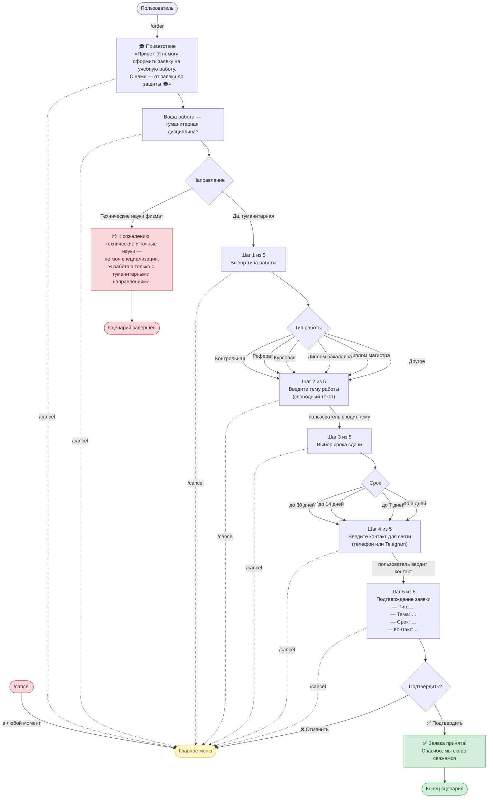

# Сценарий приёма заявки на учебную работу

## Описание шагов

| Шаг | Экран | Тип ввода | FSM-состояние |
|-----|-------|-----------|---------------|
| 0 | `/order` → приветствие | — | `OrderStates.checking_direction` |
| 0.5 | Гуманитарная / физмат? | Inline-кнопки | `OrderStates.checking_direction` |
| — | Физмат → вежливый отказ | — | сброс FSM |
| 1 | Тип работы | Inline-кнопки | `OrderStates.choosing_type` |
| 2 | Тема работы | Свободный текст | `OrderStates.entering_topic` |
| 3 | Срок сдачи | Inline-кнопки | `OrderStates.choosing_deadline` |
| 4 | Контакт для связи | Свободный текст | `OrderStates.entering_contact` |
| 5 | Подтверждение | Inline-кнопки | `OrderStates.confirming` |
| — | `/cancel` → главное меню | Команда | сброс FSM |

## Данные, собираемые в заявке

- **Направление** — гуманитарная (физмат отсекается на старте)
- **Тип работы** — Контрольная / Реферат / Курсовая / Диплом бакалавра / Диплом магистра / Другое
- **Тема** — произвольный текст от пользователя
- **Срок** — до 3 / 7 / 14 / 30 дней
- **Контакт** — телефон или @username в Telegram
- **Telegram ID и username** — берутся автоматически из объекта `message.from_user`
