# Сценарий приёма заявки на учебную работу

```mermaid
flowchart TD
    START([Пользователь]) -->|/order| S1

    CANCEL([/cancel]) -->|в любой момент| MENU([Главное меню])

    S1["🎓 Приветствие\n«Привет! Я помогу оформить заявку на учебную работу.\nСтоимость рассчитывается индивидуально под вашу работу —\nвы получите ответ в течение 2 часов после заявки.\nС нами — от заявки до защиты 🎓»"]
    S1 --> S1b

    S1b["Ваша работа — гуманитарная дисциплина?"]
    S1b --> B0{Направление}
    B0 -->|Да, гуманитарная| S2
    B0 -->|Технические науки физмат| REJECT

    REJECT["😔 К сожалению, технические и точные науки —\nне моя специализация.\nЯ работаю только с гуманитарными направлениями."]
    REJECT --> END_REJ([Сценарий завершён])

    S2["Шаг 1\nВыбор типа работы"]
    S2 --> B1{Тип работы}
    B1 -->|Другое| S3
    B1 -->|Диплом магистра| S3
    B1 -->|Диплом бакалавра| S3
    B1 -->|Курсовая| S3
    B1 -->|Реферат| S3
    B1 -->|Контрольная| S3

    S3["Шаг 2\nНаименование учебного заведения\n(свободный текст)"]
    S3 -->|пользователь вводит название| S3a

    S3a["Шаг 3\nФакультет\n(свободный текст)"]
    S3a -->|пользователь вводит факультет| S3b

    S3b["Шаг 4\nСпециализация / направление подготовки\n(свободный текст)"]
    S3b -->|пользователь вводит специализацию| S3c

    S3c["Шаг 5\nКурс"]
    S3c --> B_course{Курс}
    B_course -->|6| S3d
    B_course -->|5| S3d
    B_course -->|4| S3d
    B_course -->|3| S3d
    B_course -->|2| S3d
    B_course -->|1| S3d

    S3d["Шаг 6\nФорма обучения"]
    S3d --> B_form{Форма}
    B_form -->|Очно-заочная| S4
    B_form -->|Заочная| S4
    B_form -->|Очная| S4

    S4["Шаг 7\nВведите тему работы\n(свободный текст)"]
    S4 -->|пользователь вводит тему| S4b

    S4b["Подтвердите тему:\n«[введённый текст]»\nВсё верно?"]
    S4b --> B_topic{Тема верна?}
    B_topic -->|✅ Да, верно| S5
    B_topic -->|✏️ Ввести заново| S4

    S5["Шаг 8\nВыбор срока сдачи"]
    S5 --> B2{Срок}
    B2 -->|Другой срок...| S5b
    B2 -->|до 30 дней| S6
    B2 -->|до 14 дней| S6
    B2 -->|до 7 дней| S6

    S5b["Введите желаемую дату получения\n(свободный текст, напр. «15 июня»)"]
    S5b -->|пользователь вводит дату| S6

    S6["Шаг 9 — необязательно\nКомментарии и материалы\n\nОставьте пожелания к работе — можно написать\nтекстом или надиктовать голосовое сообщение.\nТакже прикрепите любые материалы от учебного\nзаведения: методические рекомендации, примеры\nработ, административные листы, титульный лист."]
    S6 --> B_extra{Что добавить?}
    B_extra -->|⏭️ Пропустить| S8
    B_extra -->|📎 Прикрепить файлы| S6_files
    B_extra -->|🎤 Надиктовать| S6_voice
    B_extra -->|✍️ Написать комментарий| S6_text

    S6_text["Введите комментарий или пожелания\n(свободный текст)"]
    S6_text -->|текст получен| S6_more

    S6_voice["Запишите голосовое сообщение 🎤\n(особые требования, пожелания к оформлению)"]
    S6_voice -->|голосовое получено| S6_more

    S6_files["Отправьте файл\n(методрекомендации, пример работы,\nадминлист, титульный лист — любой формат)"]
    S6_files -->|файл получен| S6_more

    S6_more{Добавить ещё?}
    S6_more -->|➕ Добавить ещё| B_extra
    S6_more -->|✅ Готово| S8

    S8["Шаг 10\nКонтакт для связи\nТелефон — обязательно.\nEmail — по желанию."]
    S8 --> S8a

    S8a["📱 Введите номер телефона\n(свободный текст)"]
    S8a -->|номер введён| S8b

    S8b["Добавить email для связи?\n(необязательно)"]
    S8b --> B_email{Email?}
    B_email -->|📧 Добавить email| S8c
    B_email -->|⏭️ Пропустить| S_trust

    S8c["Введите email\n(свободный текст)"]
    S8c -->|email введён| S_trust

    S_trust["🛡️ Вы в надёжных руках!\n\n✅ Стоимость — индивидуально под вашу работу,\n    ответ в течение 2 часов\n✅ Корректировка работы — до 2 раз бесплатно\n✅ Всё общение — прямо здесь, в боте\n✅ Работа будет принята — или доработаем\n⚡ Если что-то изменится — кнопка «Дополнить заказ»\n    всегда под рукой\n\nМы рядом от первой заявки до защиты 🎓"]
    S_trust -->|Отправить заявку| S9

    S9["Шаг 11\nПодтверждение заявки\n— Тип: …  — Институт: …\n— Факультет: …  — Специализация: …\n— Курс: …  — Форма: …  — Тема: …\n— Срок: …  — Материалы: …\n— Телефон: …  — Email: …  — Связь: …"]
    S9 --> B3{Подтвердить?}
    B3 -->|✅ Отправить заявку| S10
    B3 -->|❌ Отменить| MENU

    S10["✅ Заявка принята!\n\nМы изучим ваши материалы и в течение 2 часов\nпришлём сообщение со стоимостью работы.\n\nЕсли появятся уточнения — кнопка\n«⚡ Дополнить заказ» всегда под рукой."]
    S10 --> SYS1
    S10 --> END([Конец сценария])

    SYS1["⚙️ СИСТЕМА — владелец получает:\n📩 Сообщение в Telegram с полным брифом\n📧 Письмо на email с полным брифом\n📎 Все прикреплённые файлы студента"]
    SYS1 --> OWN1

    OWN1["👩‍💼 ВЛАДЕЛЕЦ — изучает бриф и файлы\nВводит стоимость прямо в чате с ботом:\n«Стоимость: 3500 руб., срок — 7 дней»\nБот пересылает это сообщение студенту."]
    OWN1 --> STU1

    STU1["💬 СТУДЕНТ получает сообщение с ценой:\n«Стоимость вашей работы: … руб.\nСрок выполнения: …\nГотовы оформить заказ?»"]
    STU1 --> B_order{Решение студента}
    B_order -->|✅ Оформить заказ| STU2
    B_order -->|❌ Отказаться| STU3

    STU2["✅ Заказ оформлен!\nСпасибо, специалист приступает к работе.\nЕсли появятся уточнения — «⚡ Дополнить заказ»"]
    STU2 --> SYS2["⚙️ СИСТЕМА — владелец получает:\n«✅ Студент подтвердил заказ»"]

    STU3["Жаль, что не сложилось.\nЕсли передумаете — напишите нам.\nМы всегда рады помочь 🎓"]
    STU3 --> SYS3["⚙️ СИСТЕМА — владелец получает:\n«❌ Студент отказался от заказа»"]

    MENU -->|⚡ Дополнить заказ| URG1
    URG1["⚡ Дополнить заказ\nЧто нужно передать специалисту?\nМожно написать текстом, надиктовать\nили прикрепить файл — отправим сразу."]
    URG1 --> B_urg{Что отправить?}
    B_urg -->|✍️ Написать текстом| URG2
    B_urg -->|🎤 Надиктовать голосом| URG2
    B_urg -->|📎 Прикрепить файл| URG2
    URG2["Сообщение / файл получен"] --> URG3
    URG3["✅ Передано специалисту!\nОн увидит это в ближайшее время."]
    URG3 --> MENU

    S1 -.->|/cancel| MENU
    S1b -.->|/cancel| MENU
    S2 -.->|/cancel| MENU
    S3 -.->|/cancel| MENU
    S3a -.->|/cancel| MENU
    S3b -.->|/cancel| MENU
    S3c -.->|/cancel| MENU
    S3d -.->|/cancel| MENU
    S4 -.->|/cancel| MENU
    S4b -.->|/cancel| MENU
    S5 -.->|/cancel| MENU
    S5b -.->|/cancel| MENU
    S6 -.->|/cancel| MENU
    S8 -.->|/cancel| MENU
    S8a -.->|/cancel| MENU
    S8b -.->|/cancel| MENU
    S8c -.->|/cancel| MENU
    S9 -.->|/cancel| MENU

    style S10 fill:#d4edda,stroke:#28a745,color:#155724
    style END fill:#d4edda,stroke:#28a745,color:#155724
    style REJECT fill:#f8d7da,stroke:#dc3545,color:#721c24
    style END_REJ fill:#f8d7da,stroke:#dc3545,color:#721c24
    style MENU fill:#fff3cd,stroke:#ffc107,color:#856404
    style CANCEL fill:#f8d7da,stroke:#dc3545,color:#721c24
    style S4b fill:#cce5ff,stroke:#004085,color:#004085
    style S6 fill:#e2d9f3,stroke:#6f42c1,color:#3d1e8c
    style S_trust fill:#d4edda,stroke:#28a745,color:#155724
    style SYS1 fill:#e2e3e5,stroke:#6c757d,color:#343a40
    style OWN1 fill:#fff3cd,stroke:#ffc107,color:#856404
    style SYS2 fill:#e2e3e5,stroke:#6c757d,color:#343a40
    style SYS3 fill:#e2e3e5,stroke:#6c757d,color:#343a40
    style STU2 fill:#d4edda,stroke:#28a745,color:#155724
    style STU3 fill:#f8d7da,stroke:#dc3545,color:#721c24
```

## Описание шагов

| Шаг | Экран | Тип ввода | FSM-состояние | Обязателен |
|-----|-------|-----------|---------------|------------|
| 0 | `/order` → приветствие | — | `OrderStates.checking_direction` | да |
| 0.5 | Гуманитарная / физмат? | Inline-кнопки | `OrderStates.checking_direction` | да |
| — | Физмат → отказ | — | сброс FSM | — |
| 1 | Тип работы | Inline-кнопки | `OrderStates.choosing_type` | да |
| 2 | Учебное заведение | Свободный текст | `OrderStates.entering_institution` | да |
| 3 | Факультет | Свободный текст | `OrderStates.entering_faculty` | да |
| 4 | Специализация / направление | Свободный текст | `OrderStates.entering_specialization` | да |
| 5 | Курс | Inline-кнопки (1–6) | `OrderStates.choosing_course` | да |
| 6 | Форма обучения | Inline-кнопки | `OrderStates.choosing_study_form` | да |
| 7 | Тема работы | Свободный текст | `OrderStates.entering_topic` | да |
| 7.5 | Подтверждение темы | Inline-кнопки | `OrderStates.confirming_topic` | да |
| 8 | Срок сдачи | Inline-кнопки + свой текст | `OrderStates.choosing_deadline` | да |
| 9 | Комментарии и материалы | Текст / голос 🎤 / файлы 📎 | `OrderStates.adding_materials` | нет |
| 10 | Телефон | Свободный текст | `OrderStates.entering_phone` | да |
| 10.1 | Email студента | Свободный текст | `OrderStates.entering_email` | нет |
| 10.2 | Экран доверия + гарантии | Кнопка «Отправить заявку» | — | да |
| — | ⚙️ Система → владельцу: Telegram + email + файлы | автоматически | — | — |
| 11 | Итоговое подтверждение | Inline-кнопки | `OrderStates.confirming` | да |
| — | `/cancel` → главное меню | Команда | сброс FSM | — |

## Данные, собираемые в заявке

- **Направление** — гуманитарная (физмат отсекается на старте)
- **Тип работы** — Контрольная / Реферат / Курсовая / Диплом бакалавра / Диплом магистра / Другое
- **Учебное заведение** — название института/университета, свободный текст
- **Факультет** — свободный текст
- **Специализация / направление** — свободный текст
- **Курс** — 1–6, кнопки
- **Форма обучения** — Очная / Заочная / Очно-заочная, кнопки
- **Тема** — произвольный текст, подтверждается отдельным шагом
- **Срок** — до 7 / до 14 / до 30 дней или произвольная дата
- **Материалы** — комментарии (текст), голосовые пожелания, файлы (методрекомендации, примеры работ, административные листы и др.); необязательно, можно добавлять в любом сочетании
- **Телефон** — обязательно, свободный текст
- **Email студента** — необязательно, свободный текст
- **Канал связи** — только через бот (Telegram)
- **Telegram ID и username** — берутся автоматически из объекта `message.from_user`
