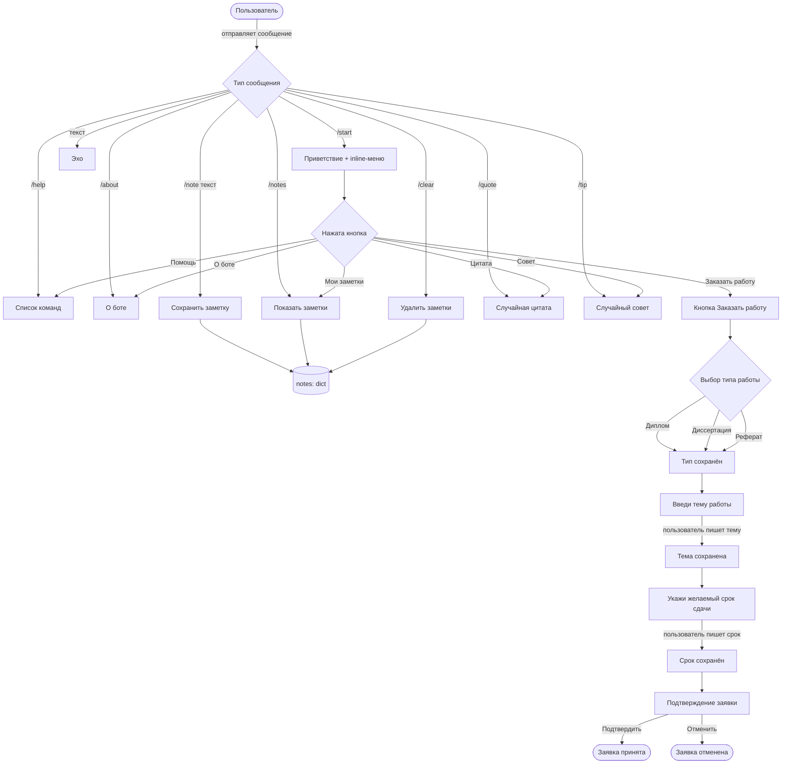

# Схема бота

```mermaid
flowchart TD
    A([Пользователь]) -->|отправляет сообщение| B{Тип сообщения}

    B -->|/start| C[Приветствие + inline-меню]
    B -->|/help| D[Список команд]
    B -->|/about| E[О боте]
    B -->|/note текст| F[Сохранить заметку]
    B -->|/notes| G[Показать заметки]
    B -->|/clear| H[Удалить заметки]
    B -->|/quote| I[Случайная цитата]
    B -->|/tip| J[Случайный совет]
    B -->|текст| K[Эхо]

    C --> L{Нажата кнопка}
    L -->|Цитата| I
    L -->|Совет| J
    L -->|Мои заметки| G
    L -->|О боте| E
    L -->|Помощь| D
    L -->|Заказать работу| N1

    F --> M[(notes: dict)]
    G --> M
    H --> M

    N1[Кнопка Заказать работу] --> N2{Выбор типа работы}
    N2 -->|Диплом| N3[Тип сохранён]
    N2 -->|Диссертация| N3
    N2 -->|Реферат| N3
    N3 --> N4[Введи тему работы]
    N4 -->|пользователь пишет тему| N5[Тема сохранена]
    N5 --> N6[Укажи желаемый срок сдачи]
    N6 -->|пользователь пишет срок| N7[Срок сохранён]
    N7 --> N8[Подтверждение заявки]
    N8 -->|Подтвердить| N9([Заявка принята])
    N8 -->|Отменить| N10([Заявка отменена])
```
